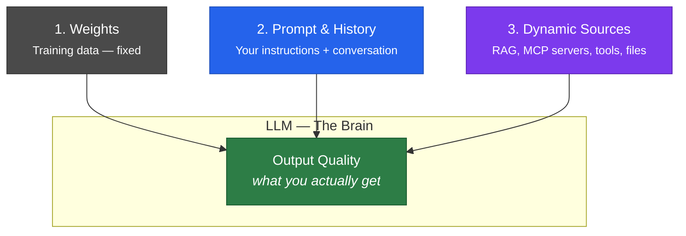
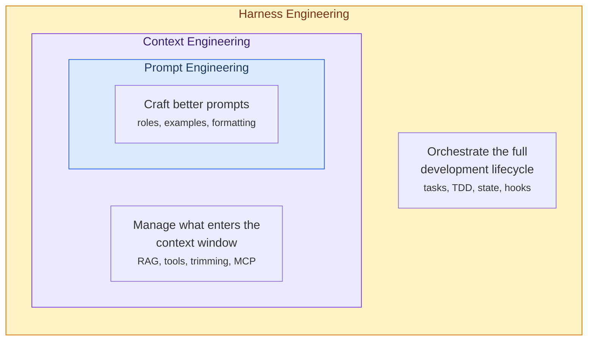
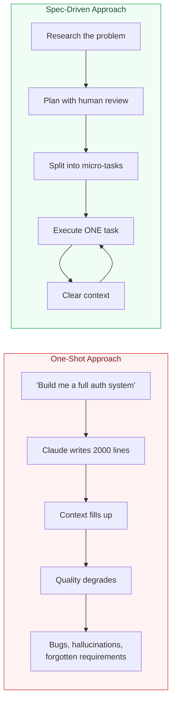
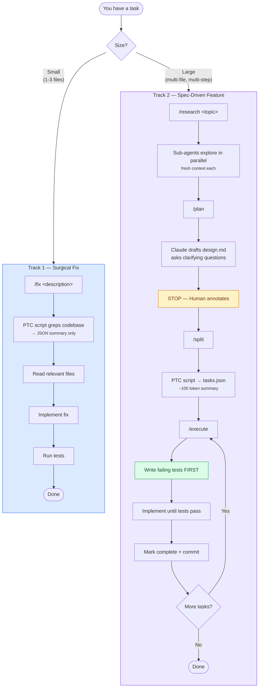
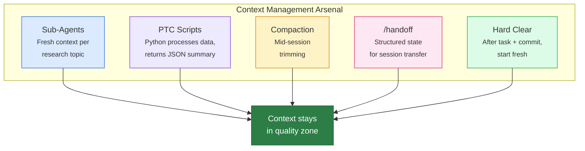
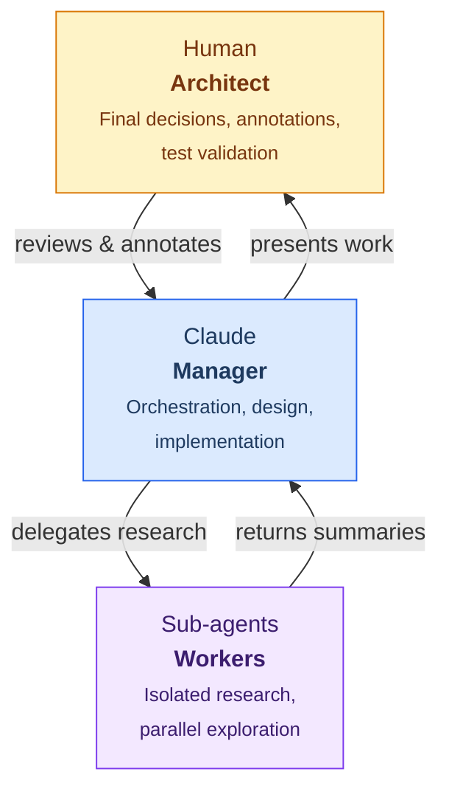

# Harness Engineering

**A Claude Code plugin that keeps AI output quality high by keeping context clean.**

Stop one-shotting entire apps. Start engineering the harness.

---

## The Problem

You've seen it happen. Claude starts strong — clean code, sharp reasoning — then 40 minutes in, it loses the thread. Repeats itself. Forgets decisions it made 10 messages ago. Hallucinates file states. The code quality drops off a cliff.

This isn't a model failure. It's **context rot**.

```
┌─────────────────────────┐
│                         │
│    Context Rot Zone     │  ← Quality degrades here.
│    ···················  │    The model is "drunk"
│    ···················  │    on its own noise.
│                         │
├ ─ ─ ─ ─ ─ ─ ─ ─ ─ ─ ─ ┤  ← ~50% utilization threshold
│                         │
│                         │
│     Quality Zone        │  ← Sharp, coherent output.
│                         │    This is where you want
│                         │    to stay.
│                         │
└─────────────────────────┘
       Context Window
```

Research from both [Anthropic](https://www.anthropic.com/engineering/effective-harnesses-for-long-running-agents) and [OpenAI](https://openai.com/index/harness-engineering/) confirms it: past ~40-50% context utilization, model performance degrades. The bigger the task, the faster you hit the rot zone. That's why "just asking Claude to build the whole thing" doesn't scale.

---

## Why This Exists

The LLM is a brain. Its "IQ" — the quality of its output — depends entirely on what's in its context window.



You can't change the weights. But you **can** engineer what goes into the prompt, history, and dynamic context. That's what this plugin does.

**All we're trying to do is optimize context to maximize output quality.**

---

## The Three Disciplines

This isn't a new idea — it's the natural evolution of how we work with LLMs:



| Discipline | What it optimizes | Example |
|---|---|---|
| **Prompt Engineering** | The instruction itself | "You are a senior engineer. Write tests first." |
| **Context Engineering** | What's in the window | PTC scripts return 50 tokens instead of 2000. Sub-agents get fresh context. |
| **Harness Engineering** | The entire workflow | Track routing, TDD gates, micro-task decomposition, state recovery across sessions. |

Each layer contains the previous. Prompt engineering alone can't save you from context rot. Context engineering alone can't enforce TDD. You need the full harness.

### Think of It Like Water Bottles

```mermaid
graph LR
    subgraph PE_COL["Prompt Engineering"]
        direction TB
        POUR["Pour water<br/><small>craft tokens</small>"]
        BOTTLE1["🫙 One bottle"]
    end

    subgraph CE_COL["Context Engineering"]
        direction TB
        LEVEL["Monitor fill level<br/><small>manage utilization</small>"]
        BOTTLE2["🫙 One bottle<br/>━━ 50% line ━━"]
        QZ1["✓ Quality zone"]
    end

    subgraph HE_COL["Harness Engineering"]
        direction TB
        FACTORY["The factory"]
        B1["🫙 50%"]
        B2["🫙 50%"]
        B3["🫙 50%"]
        QZ2["✓ All in quality zone"]
    end

    PE_COL --> CE_COL --> HE_COL

    style PE_COL fill:#dbeafe,stroke:#2563eb,color:#1e3a5f
    style CE_COL fill:#ede9fe,stroke:#7c3aed,color:#3b1d6e
    style HE_COL fill:#fef3c7,stroke:#d97706,color:#78350f
    style QZ1 fill:#dcfce7,stroke:#16a34a,color:#14532d
    style QZ2 fill:#dcfce7,stroke:#16a34a,color:#14532d
```



| Concept | Water Analogy | In Practice |
|---|---|---|
| **Water** | Tokens | Prompts, tool outputs, file contents |
| **Bottle** | Context window | The model's working memory |
| **Fill level** | Utilization % | Must stay under 50% (quality zone) |
| **The factory** | Harness | Sub-agents (parallel bottles), PTC, micro-tasks, track routing |

> **Key insight**: Prompt and context engineering optimize a single bottle. Harness engineering decides how many bottles you need, fills them asynchronously, and enforces the half-capacity rule so every bottle stays in the quality zone.

---

## The Solution: Spec-Driven Development

Don't one-shot the whole app. Break it into **micro-tasks** that each fit in the quality zone.



Each micro-task stays well under the context budget. After each task, context can be cleared — `claude-progress.txt` and `tasks.json` provide full state recovery. No context rot. No quality degradation.

---

## How It Works

Two tracks, matched to task size:



**Key gates:**
- **Human annotation** — you review and annotate the design before any code is written
- **TDD gate** — failing tests are written *before* implementation, always
- **Context clear** — after each micro-task completes, context can be safely reset

---

## Staying in the Quality Zone

Five techniques keep context utilization under 50%:



### PTC: The Token Multiplier

**Programmatic Tool Calling** is the biggest lever. Instead of dumping raw grep output into Claude's context, Python scripts process it and return only structured JSON:

```
Without PTC:                          With PTC:
┌──────────────────────┐              ┌──────────────────────┐
│ grep output:         │              │ Python processes,    │
│ ~500-2000 tokens     │              │ returns JSON:        │
│ per search           │              │ ~50 tokens           │
│                      │              │ per search           │
│ 10 searches =        │              │                      │
│ 5,000-20,000 tokens  │              │ 10 searches =        │
│                      │              │ 500 tokens           │
│ ██████████████████░░ │              │ ██░░░░░░░░░░░░░░░░░░ │
│ Context: 80%+        │              │ Context: ~5%         │
└──────────────────────┘              └──────────────────────┘
                    85-98% token savings
```

Every skill in this plugin has dedicated PTC scripts. Data stays in the Python sandbox. Only summaries enter the context window.

---

## Quick Start

### Install

Add the marketplace and install:

```
/plugin marketplace add emingenc/harness-engineering
/plugin install harness-engineering@harness-engineering
```

Or from the CLI:

```bash
claude plugin marketplace add emingenc/harness-engineering
claude plugin install harness-engineering@harness-engineering
```

By default plugins install to **user** scope (all projects). Use `--scope project` to share with your team or `--scope local` for project-only.

All commands, skills, and hooks are auto-discovered on next session start.

### Track 1: Fix Something

```
> /fix The login button doesn't redirect after OAuth callback
```

Claude will scope-check the task, grep the codebase via PTC scripts, read only the relevant files, implement the fix, and run tests. Single session, minimal context.

### Track 2: Build a Feature

```
> /research user authentication patterns for this codebase
> /plan
  ← Claude drafts design.md, asks clarifying questions, then STOPS
  ← You annotate the design.md offline
> /split
  ← PTC script generates tasks.json from your annotated design
> /execute
  ← Picks next task, writes failing tests, implements, marks complete
> /execute
  ← Next task...
```

Each `/execute` can run in a fresh context. State is preserved in `tasks.json` and `claude-progress.txt`.

---

## Architecture at a Glance

```
harness-engineering/
├── .claude-plugin/
│   └── plugin.json              # Plugin manifest
├── commands/                     # 9 slash commands
│   ├── fix.md                   #   /fix — Track 1
│   ├── research.md              #   /research — Track 2
│   ├── plan.md                  #   /plan — Track 2
│   ├── split.md                 #   /split — Track 2
│   ├── execute.md               #   /execute — Track 2
│   ├── new-skill.md             #   /new-skill — create skills
│   ├── handoff.md               #   /handoff — context transfer
│   ├── status.md                #   /status — progress overview
│   └── verify.md                #   /verify — structural checks
├── skills/                       # 7 auto-discovered skills
│   ├── small-fix/               #   Track 1 surgical fixes
│   ├── prompt-enhancer/         #   Improve LLM prompts
│   ├── skill-factory/           #   Scaffold new skills
│   ├── researcher/              #   Track 2 research
│   ├── planner/                 #   Track 2 design generation
│   ├── task-splitter/           #   Track 2 micro-separation
│   └── executor/                #   Track 2 one-task execution
├── hooks/
│   └── hooks.json               # 4 workflow enforcement hooks
├── scripts/
│   └── progress.py              # Cross-session state management
├── docs/                         # Progressive disclosure
│   ├── architecture.md
│   ├── conventions.md
│   ├── ptc-guide.md
│   ├── tutorials.md              # Step-by-step use case guides
│   └── templates/
├── claude-progress.txt           # Append-only session log
└── tasks.json                    # Active micro-task list
```

### Components

| Layer | Count | Purpose |
|-------|-------|---------|
| **Commands** | 9 | User-facing slash commands for both tracks |
| **Skills** | 7 | Auto-activated guidance for Claude's behavior |
| **PTC Scripts** | 12 | Python scripts that process data outside context |
| **Hooks** | 4 | Workflow enforcement (TDD gate, track routing, state preservation) |

---

## Key Concepts

### TDD Gate
Track 2's executor writes **failing tests before implementation**. Always. The Stop hook blocks completion if this step was skipped. This is the primary safeguard against "code that seems to work but doesn't."

### 2-Pass Debugging Rule
If Claude can't find a bug in 2 attempts, it stops. Writes state to `claude-progress.txt` and recommends a context clear. This prevents the "sorry, let me try again" death spiral where the model apologizes endlessly without actually fixing anything.

### State Recovery
Any new session reconstructs state from three sources: `claude-progress.txt` (what happened), `tasks.json` (what's left), and `git log` (what's actually in the code). No single source of truth — they cross-validate each other.

### Context Budget: <50%
The hard ceiling. All five context management techniques (sub-agents, PTC, compaction, handoff, hard clear) exist to keep utilization below this line. Above it, you're in the rot zone.

### Human as Architect


You are always the final arbiter. Claude manages execution. Sub-agents do isolated work with fresh context. This hierarchy prevents the model from making unsupervised architectural decisions.

---

## Tutorials

Step-by-step guides for common workflows. See **[docs/tutorials.md](docs/tutorials.md)** for the full walkthroughs.

| Tutorial | Track | What You'll Learn |
|----------|-------|-------------------|
| **Fix a Bug** | 1 | Scope check, PTC-assisted grep, minimal fix |
| **Build a Feature** | 2 | Full research → plan → annotate → split → execute cycle |
| **Resume After a Break** | - | `/status` and `/handoff` for session recovery |
| **Create a Custom Skill** | - | `/new-skill` with PTC scripts and auto-discovery |
| **Improve a Prompt** | - | Analyze weak prompts, get scored suggestions |
| **Debug a Stuck Session** | - | 2-Pass Rule, state logging, fresh approach |
| **Verify Plugin Integrity** | - | Structural checks across skills, commands, and manifests |
| **Multi-Session Feature** | 2 | Context handoff across 3-4 sessions |

---

## Creating New Skills

This plugin includes a `skill-factory` for scaffolding track-aware skills with PTC scripts. For general skill creation, we recommend [Anthropic's skill-creator](https://github.com/anthropics/claude-code) — it handles evaluation, optimization, and best practices out of the box.

```
> /new-skill my-custom-skill
```

---

## References & Inspiration

This plugin synthesizes ideas from:

- **[Anthropic: Effective Harnesses for Long-Running Agents](https://www.anthropic.com/engineering/effective-harnesses-for-long-running-agents)** — The foundational harness engineering paper
- **[OpenAI: Harness Engineering](https://openai.com/index/harness-engineering/)** — Context budget research (~40% degradation threshold)
- **[Boris Tane: Spec-Driven Claude Code](https://boristane.com/blog/how-i-use-claude-code/)** — The annotation-driven planning loop
- **[shanraisshan/claude-code-best-practice](https://github.com/shanraisshan/claude-code-best-practice)** — Plugin structure, command/skill patterns
- **[MACHINE Framework](https://www.youtube.com/watch?v=RFrPCabHx7M)** — Mapping, Agents, Context, Harness, Intuition, Natural Language, Engineering (excellent channel, highly recommended)

---

## License

MIT
